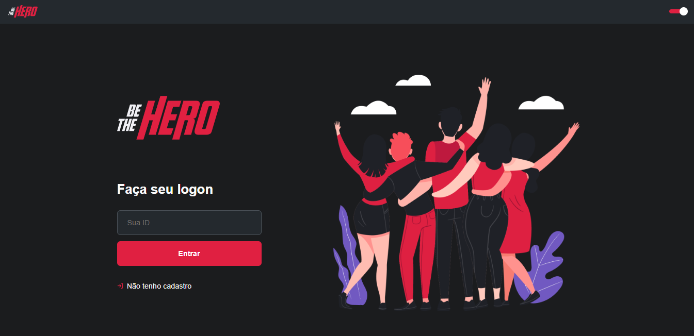

<h1 align="center">
    
</h1>

## :pushpin: Modificações
1. Quando o usuário se registrar, ele será redirecionado para a rota 'profile'.
2. Quando a ONG não possui casos registrados, aparece uma mensagem informando que não há casos registrados.
3. Eslint e Prettier para padronizar o código.
4. Styled-components para estilizar a aplicação.
5. Dark/Light Theme.
6. Front-end responsivo.
7. Alertas personalizados.

## :rocket: Tecnologias

- [Axios](https://github.com/axios/axios)
- [React](https://reactjs.org/)
- [React icons](https://react-icons.netlify.com/)
- [React router](https://reacttraining.com/react-router/)
- [React toastify](https://www.npmjs.com/package/react-toastify)
- [Styled Components](https://styled-components.com/docs)

## :memo: Licença

Este projeto está sob a licença MIT. Veja o [LICENSE](https://github.com/arauj0/be-the-hero/blob/master/LICENSE) para maiores informações.

---

Made by :blue_heart: by [Larissa Araújo](https://github.com/arauj0)
