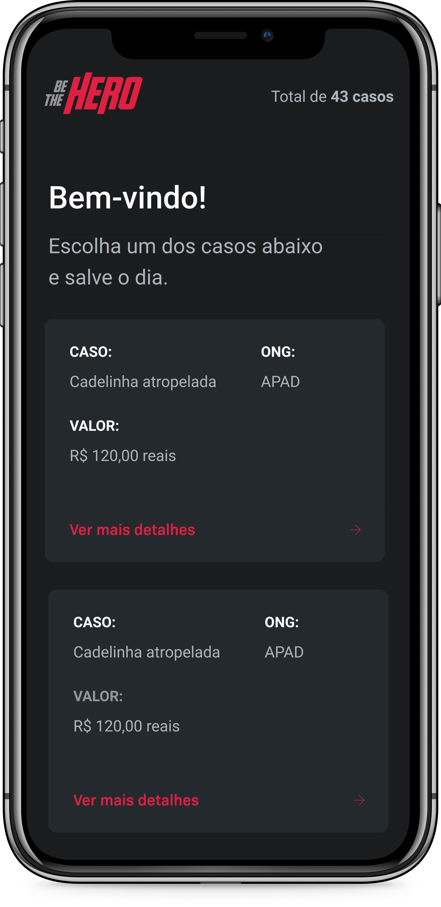

<h1 align="center">
    
</h1>

## :computer: Modifications
1. Eslint and Prettier to standardize the code.
2. Styled-components to style the application.
3. Dark Theme.

## :rocket: Technologies

- [Axios](https://github.com/axios/axios)
- [Expo](https://expo.io/)
- [Expo mail composer](https://docs.expo.io/versions/latest/sdk/mail-composer/)
- [Intl](https://github.com/andyearnshaw/Intl.js)
- [React native](https://facebook.github.io/react-native/)
- [React navigation](https://reactnavigation.org/)
- [Styled Components](https://styled-components.com/docs)

## :memo: License

This project is under the MIT license. See the [LICENSE](https://github.com/arauj0/be-the-hero/blob/master/LICENSE) for more information.

---

Made by :blue_heart: by [Larissa Araújo](https://github.com/arauj0)
